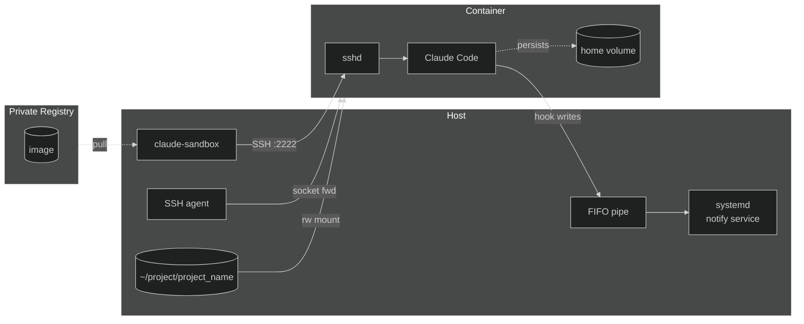

I've been using Claude Code heavily for the past few months, and at some point I started getting uncomfortable with what it could reach. Not because it had done anything wrong — it hadn't — but because the blast radius if something did go wrong was my entire home directory. One rogue prompt injection in a skill file or a malicious string lurking in some library's README, and Claude dutifully `rm -rf`s the wrong thing or reads my SSH keys into a response. It can't run `sudo`, sure, but it doesn't need to. Everything that matters to me as a user lives in `~`.

So I built a sandbox. This post is about what that looks like, why I made the decisions I did, and where I think it still has gaps.

---

## The Shape of the Thing

The setup has three moving parts:

1. A container image with Claude Code baked in, hosted on a private Docker registry in my [homelab]()
2. A shell function that pulls and runs that image using Podman
3. A notification bridge so I know when Claude finishes something, even when I've switched contexts

When I want to use Claude Code on a project, I `cd` into it and run `claude-sandbox`. That's a bash script which pulls the latest image from my registry, spins up a container with my current directory mounted into it, and SSHes me in. From inside, it looks and feels like a normal shell — git works, my editor config is there, Claude Code is on the PATH. From outside, it's an isolated process with a trimmed capability set and no access to the rest of my filesystem. 

Component diagram showing the full topology — two zones (Host, Container) with the Registry off to the side:




---

## The Image

The image is Ubuntu 24.04 with Claude Code installed via the official install script, plus Go, `uv`, `just`, and a few other tools I want available. It's built in my [homelab]() on a systemd timer that fires nightly, and the result gets pushed to a private Docker registry running behind my standard Traefik reverse proxy. 

The nightly rebuild matters because Claude Code updates frequently. I don't want to think about whether the version in my sandbox is stale — I just want it to always be current.

The Dockerfile is straightforward. The only slightly clever thing is a multi-stage build to download Go cleanly before the final layer. Claude Code itself goes in via `curl | bash`, which is not my preferred pattern for reproducibility but is what the official distribution offers.

Why Go? It's rapidly becoming the language I prefer to use over Python, the previous favorite. Go is also the language used in my exploration of [Spec Driven Development]()

---

## The Shell Function

The `claude-sandbox` function has a fallback chain for resolving the image:

1. Try to pull from the private registry (always fresh)
2. If the registry is unreachable but the image exists locally, use the cached version
3. If neither, fall back to a local build from a Dockerfile kept at `~/.config/claude-sandbox`

This matters because my homelab isn't always on. If I'm working from somewhere without VPN access to my network, I still want a sandbox. The third fallback means I'm never blocked, just potentially running an older image.

Once the image is resolved, the function runs it with Podman. A few things are worth calling out in the run flags:

**Capability trimming.** The container starts with all Linux capabilities dropped, then adds back only what's needed: `SETUID`, `SETGID`, `SYS_CHROOT`, and `DAC_OVERRIDE`. `no-new-privileges` prevents anything inside from escalating further. This is the difference between "Claude can't run sudo" (the default) and "Claude is operating in a box where privilege escalation is structurally prevented."

**User namespace mapping.** `--userns=keep-id` is a Podman feature that maps the container's user to the host's user without requiring root. File ownership on mounted volumes Just Works, which matters because I'm mounting my project directory in.

**What gets mounted.** Only three things from my host filesystem go into the container:
- The current working directory, read-write (this is what Claude works on)
- My `authorized_keys` file, read-only (for SSH access into the container)
- My `.gitconfig` and Neovim config, read-only (so the environment feels consistent)

Crucially, `~/.ssh` is not mounted. Claude can make git commits and push over SSH because I forward my SSH agent into the container — the agent runs on the host, and the container gets a socket to talk to it. It never sees the private keys.

**Home directory persistence.** The container's `/home/ubuntu` is backed by a named Podman volume. This means Claude Code's own configuration, cached state, and the SSH host keys the container generates on first boot all survive across restarts. Without this, every `claude-sandbox` invocation would be starting cold, and the SSH host key churn would be annoying to manage.

---

## Why SSH and Not `exec`

The natural question is: why SSH into the container at all? `podman exec -it` exists and is simpler.

Two reasons. First, I use [tmux](https://github.com/tmux/tmux/wiki) — a terminal multiplexer that lets you run persistent shell sessions you can detach from and reattach to later. When Claude is running a long task, I want to detach and do something else without killing the session. The SSH approach lets me rename the tmux window automatically when I connect, which makes it easy to find again later. With `exec`, the session lifecycle is tied to the exec process in a way that's harder to manage cleanly in tmux.

Second, and more practically: Claude Code's UI wasn't rendering correctly when I tried `exec`. I couldn't tell if it was my terminal emulator (Ghostty), tmux's handling of the TTY, or something else. SSH gives a clean, well-understood TTY that sidesteps the whole question. Sometimes "I don't know what's wrong but this works" is the right engineering answer.

The container runs an OpenSSH server on port 2222, bound only to loopback. SSH agent forwarding means git operations work inside the container without any credentials living there.

---

## The Notification Bridge

Claude Code can run for a long time. When I kick off a large task, I want to know when it finishes without staring at the terminal. But desktop notifications from inside a container are non-trivial — the container has no access to the host's display or notification daemon.

The solution is a named pipe (FIFO) shared between the container and the host. The host-side is a small bash script running under a systemd user service. It creates the FIFO if it doesn't exist, then sits in a loop reading from it. When a message arrives, it calls `notify-send`, which fires a standard desktop notification.

```bash
while true; do
    if read -r msg < "$PIPE"; then
        notify-send -u critical "Claude Code" "$msg"
    fi
done
```

The FIFO is mounted into the container at `/tmp/cc-notify-pipe`. Two Claude Code hooks write to it: a `PermissionRequest` hook that formats the tool name and first argument with `jq` and truncates to 80 characters, and a `Stop` hook that writes `"Completed"`. Both redirect directly to the pipe — no special tooling needed inside the container.

It's deliberately low-tech. A named pipe is one of the oldest IPC mechanisms around, it requires no network, no daemon, no protocol. The only gotcha is that the systemd service needs `DISPLAY` and `XDG_RUNTIME_DIR` set explicitly, because it starts before the graphical session environment is fully propagated.

---

## What This Doesn't Solve

A few gaps worth being honest about:

**Network access is unrestricted.** The container can make outbound connections freely. If something inside wanted to exfiltrate data, it could. Locking this down properly would mean either a strict egress firewall or a more sophisticated proxy setup. I haven't done this yet.

**The mounted directory is read-write.** I've scoped the mount to just the project I'm working on, which limits the blast radius significantly compared to mounting `~`. But Claude can still delete or modify any file in that project. That's mostly intentional — it needs to be able to do its job — but it's worth stating clearly.

**The home volume is broad.** Everything in `/home/ubuntu` persists. That includes Claude Code's own configuration and memory files. If something manipulated those, the effect would persist across sessions. This is a real risk that a more paranoid setup would address by making the home volume read-only except for specific subdirectories.

---

## What I'd Do Differently

If I were building this for production rather than personal use, I'd look at egress filtering seriously. Even a simple allowlist (GitHub, PyPI, the Anthropic API) would cut the exfiltration surface dramatically.

I'd also think harder about the home volume. Right now it's convenience-oriented — Claude keeps its memory and config between sessions, which makes it more useful. But that persistence is also a potential attack surface. There's a real tension there between usability and isolation, and I've currently resolved it in favor of usability.

The daily image rebuild is maybe the thing I'm most happy with. Keeping the sandbox current automatically means I never have to think about it, and Claude Code's pace of development means a stale image quickly becomes a meaningfully different tool.

---

The threat model I was designing against was prompt injection — something in a library file, a web page Claude fetches, a skill definition — causing Claude to do something destructive or leaky with access I'd given it. Containerization doesn't eliminate that risk, but it makes the consequences survivable. If Claude nukes the project directory, I lose some work. If it had access to my whole home directory, I lose a lot more. That's the trade.
