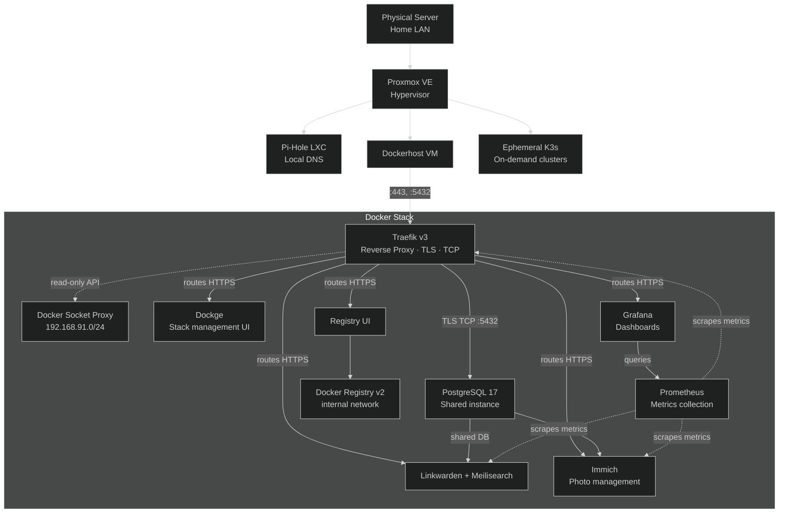

For the last several months I've started running my own homelab on a single cheap server machine sitting on my home LAN. The primary motivation for this was to familiarise myself with running a server and multiple services on bare metal and understand how to manage such infrastructure. 

## Infrastructure

I chose a refurbished Dell Optiplex 7040 Mini PC to host the infrastructure. As multiple workloads were expected, I chose to install Proxmox VE on this device. Proxmox is a Debian derivative Linux distribution that is designed to act as a hypervisor for VMs and lightweight Linux Containers (LXCs) from a common compute and storage infrastructure. It can be used to manage a data center with multiple physical hosts, but in my setup there is only one server. 

Proxmox also makes it easy to schedule and manage backups, which have been enabled on the workloads.

The main actors in the Proxmox setup are:

- **Pi-Hole LXC** — handles DNS for the local network. This was the first provisioned service, as it handles the DNS routing for everything else
- **Dockerhost VM** — the main workhorse, running all containerized services
- **Ephemeral K3s clusters** — brought up on demand when I want to explore Kubernetes topics, then torn down

On my LAN, Pi-Hole and the Dockerhost both have reserved IP addresses. The network map is below

This makes it easy to SSH into any of them when needed. The service map is below

## DNS and HTTPS

I own the domain I use for the homelab. Pi-Hole is configured to resolve my local subdomains to the Dockerhost's LAN IP. Because I own the domain and use Cloudflare for DNS, I can solve the ACME DNS-01 challenge to get real, trusted Let's Encrypt certificates — even for services that are only accessible on my LAN and never exposed to the internet. This means all services run under valid HTTPS with no browser warnings. As this is a home network with no externally-facing services, an alternative would have to have Traefik issue self-signed certificates and trust it. But this was consciously not chosen as I wanted a solution that would work without configuring every device. 

The Cloudflare DNS API token is passed to Traefik as a secret, and Traefik handles certificate issuance and renewal automatically.

## The Docker Stack

All services on the Dockerhost are managed with **Docker Compose**. A few shared infrastructure services underpin everything else.

### Traefik (Reverse Proxy)

**Traefik v3** is the entry point for all HTTP and TCP traffic. It listens on port 443 and routes requests to the correct container based on the `Host` header. Each application declares its own routing rules via Docker labels — no central routing config to maintain.

Beyond HTTP, Traefik also handles **TLS-wrapped TCP routing for PostgreSQL**. The shared Postgres instance is accessible via a Traefik TCP router with its own Let's Encrypt certificate. This means database connections from within the homelab (or potentially other machines on the LAN) go through proper TLS without any extra VPN setup.

Traefik is allowed to issue certificates for any `*.<mydomain>` site, and all the applications live in subdomains of my domain.

### Docker Socket Proxy

Rather than mounting the Docker socket directly into Traefik (which would give it unrestricted access to the Docker daemon), a **Docker Socket Proxy** (`tecnativa/docker-socket-proxy`) sits in between. It runs on a dedicated, isolated bridge network (`192.168.91.0/24`) and exposes only the specific API endpoints that Traefik and other management tools actually need. Write access to sensitive endpoints like `/auth` and `/secrets` is blocked.

### PostgreSQL

A single **PostgreSQL 17** container is shared across all applications that need a database. Rather than running one Postgres per app (wasteful on a small machine), apps get their own user and database on the shared instance. The root password is managed as a file-based secret; each app's password is generated and stored the same way.

### Dockge

**Dockge** is used for managing and monitoring the compose stacks through a web UI. Stacks are stored at `/opt/stacks/<name>/` — this is the path Dockge expects — so the deploy process writes composed files there.

## Applications

### Linkwarden

**Linkwarden** is a self-hosted bookmark manager. It uses the shared PostgreSQL instance for its database and **Meilisearch** as a search backend (running as a sidecar container in the same compose stack)

### Immich

**Immich** is a self-hosted photo and video management platform. It handles automatic backup from mobile devices and provides a web UI and mobile app for browsing and searching the library. Like Linkwarden, it uses the shared PostgreSQL instance for its database and sits behind Traefik.

### Prometheus and Grafana

**Prometheus** scrapes metrics from the running Docker apps — including Traefik, Linkwarden, and Immich — and stores them locally. **Grafana** provides dashboards on top of Prometheus, giving a single place to watch request rates, error rates, container resource usage, and anything else the apps expose. Grafana is the only service in this stack exposed through Traefik; Prometheus itself is not routed externally.

### Private Docker Registry

A private **Docker Registry v2** instance stores custom-built images. A lightweight **registry UI** (`joxit/docker-registry-ui`) sits in front of it and is the only service exposed to Traefik; the registry itself sits on an internal network (`registry_internal`) not reachable from outside the compose stack.

## Deployment Pipeline

The deployment workflow is deliberately simple and leans on standard Git primitives.

The Dockerhost has a **bare Git remote** for the infrastructure repo. Pushing to it (`git push homelab main`) fires a `post-receive` hook on the server. The hook:

1. Checks out the pushed commit into a temporary directory
2. Runs `just deploy` from that directory
3. Cleans up the temp directory

`just` (a command runner, a spiritual successor to `make`) handles the per-service deploy logic in a `justfile`. Each service has a `deploy-<name>` recipe that:

- Provisions any required secrets (idempotently — won't overwrite existing ones)
- Provisions a PostgreSQL user and database if needed
- Copies the compose stack to `/opt/stacks/<name>/` with secrets substituted in
- Dockge picks up the changes automatically

Secrets are stored as plain files on the server (e.g. `~/appconfig/secrets/<name>`). The `mk_secret` script generates a random 10-character alphanumeric string and writes it to a file if the file doesn't already exist. The `mk_pg_user` script builds on this to provision a Postgres user idempotently. This file-based secrets approach keeps the workflow simple without needing a secrets manager.

## Claude Code Container Image

One custom image in the registry is a **Claude Code development environment**. The image is built on Ubuntu 24.04 and includes Go, Node.js, Git, Python, and Claude Code (installed via the official install script). It runs an SSH server on port 2222 with key-based authentication only, so I can SSH into a running container to work from any machine.

A **systemd timer** on the Dockerhost rebuilds this image daily and pushes it to the private registry, so it always has a recent version of Claude Code without any manual intervention.

More on the motivation on this Claude Code Container in a separate post.

## Design Principles

A few recurring ideas tie the setup together:

**Everything is code.** The full state of running services is captured in this repository. Deploying from scratch is a push.

**Shared infrastructure, isolated application logic.** Traefik, Postgres, and the socket proxy are shared and managed centrally. Each application's compose file declares only what is unique to it and references the shared services as external networks or remote hosts.

**Minimal exposure.** The Docker socket is never mounted directly. PostgreSQL is not port-forwarded to the host; it's routed through Traefik with TLS. The registry backend is on an internal network. The principle of least privilege is applied where it's low-friction.

**Idempotent deploys.** Every deploy recipe is safe to run repeatedly. Secrets and database users are only created if they don't already exist. A push that touches only one service still runs `just deploy` in full without causing problems.

**Valid HTTPS everywhere.** Using the DNS-01 challenge means every service — even internal-only ones — gets a properly signed certificate. No self-signed certs, no browser exceptions to manage.

## Future Plans

While this homelab works, some refinements are needed:

1. The compose stacks are managed on my develop machine and then `git push`ed to the homelab, as intended. However, each app or service needs a lot of configuration. For example Traefik has its entryPoints that need to be configured. I need to find a way to also manage this in the dev machine and `git push` it to the homelab.
2. A potential K3s migration needs to be considered, weighing the complexity it would introduce. Currently K3s is a side project here
3. Open-source the homelab git repo
4. This is not strictly GitOps, because that would imply the homelab continuously reconciles itself against the configuration. This is a git-driven deployment, so there is a potential to explore a true GitOps flow.
