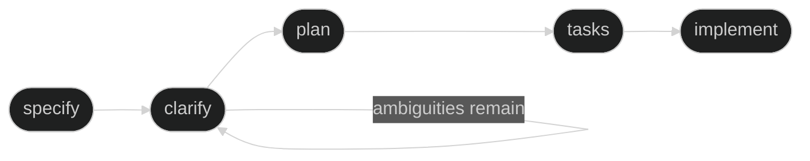
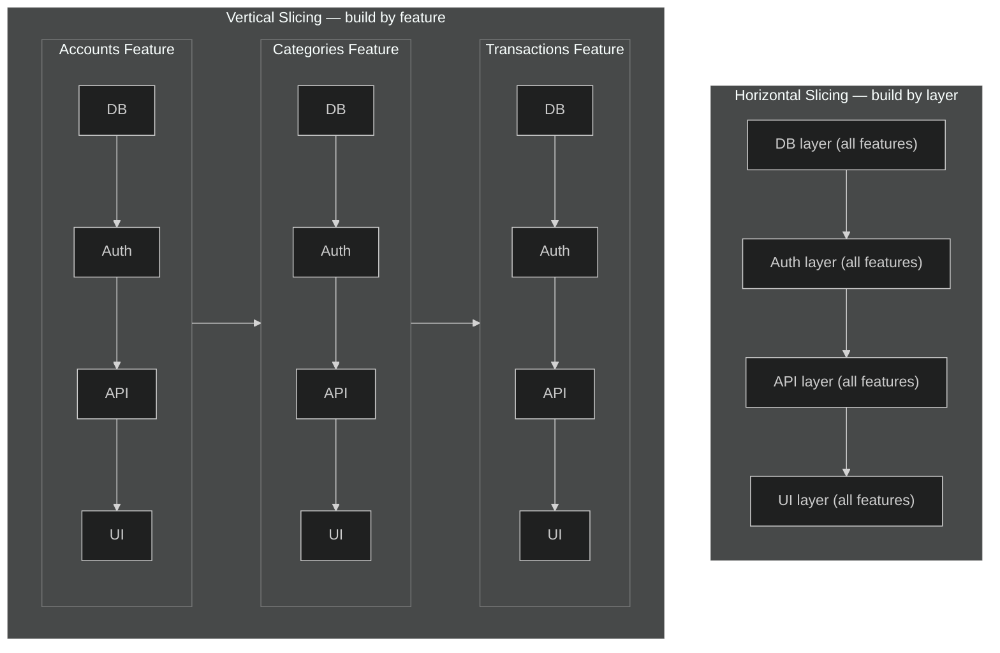

I recently started using SpecKit for personal projects to understand how it handles a growing codebase. I went in with the mental model of one feature = one spec. That held up well early on; it started showing cracks as the project grew and incremental updates became harder to slot into SpecKit's constructs.

[SpecKit](https://github.com/github/spec-kit) is an open source toolkit from GitHub that aims to provide a Spec Driven Development (SDD) workflow around coding agents. The core idea is to define the specification (spec) first and then drive the agentic software dev based on those specs. In theory, this should make the code more robust as the agent is following clearly defined requirements. Of course, the specs themselves need not be entirely written manually, though the requirement at its core must come from the human. Taken to its logical conclusion, the spec is treated as the source with the LLM acting as a compiler of sorts that converts the spec into the code. How well this matches reality, was what I was trying to explore.  

I also looked in parallel at [OpenSpec](https://github.com/Fission-AI/OpenSpec), another SDD tool. It has a similar workflow as SpecKit, but is a bit more lightweight in terms of generating fewer artifacts. I settled on SpecKit though, as it is way more popular then OpenSpec.

The app is a personal finance web app inspired by [YNAB](https://www.ynab.com), built around these design choices:

1. **Postgres + Go API**: Go constrains the space of correct programs in ways that are useful when an LLM is writing most of the code. Visibility follows capitalization, unused code is a compile error, and the toolchain is fast. Compared to Python, there's less room for the model to be subtly wrong and have it compile anyway.
2. **Go CLI**: A CLI lets Bash scripts interact with the app and leaves the door open for an LLM to call it directly. There's [active debate in the community](https://www.scalekit.com/blog/mcp-vs-cli-use) about CLI vs MCP for this kind of use case; for a personal app, CLI felt more appropriate.
3. **React + shadcn + Vite frontend**: Frontend is the part of the stack I know least well, so this was the most unfamiliar territory.
4. No authentication and no multi-user support — this isn't a commercial product.

These were my design choices going in. SpecKit worked within them.

# How I went about it

- Ran the `superpowers:brainstorming` skill for initial design. [Superpowers](https://github.com/obra/superpowers) is an independent open-source project, it's not part of SpecKit, but is an incredibly useful set of skills that help in agentic coding workflows. It surfaced tradeoffs I hadn't thought through — including the observation that modeling the CLI after `docker` or `kubectl` would reduce onboarding friction for both humans and agents. The output was a prioritized feature list.
- Passed that feature list to SpecKit one feature at a time for implementation.
- Used [Google Stitch](http://stitch.withgoogle.com/) to mock up the frontend and handed the mockup to Claude Code as a reference for the React UI.
- Claude Code runs inside a Docker image hosted on a registry on my homelab, rebuilt nightly. When I want a session, I `podman run ...` and SSH in. More on the homelab in a separate future post.

# What worked well

- Each feature gets its own branch, keeping changes self-contained. OpenSpec doesn't mandate this, and the difference shows.
- Enforcing red-green TDD through `constitution.md` works well. It gives the LLM a regular checkpoint to verify its output, rather than generating a large block of code and hoping for the best
- Code quality was consistently high, and so was adherence to the provided spec
- Go paid off. The compiler catches a class of mistakes the LLM might otherwise leave behind.
- The brainstorming skill is genuinely useful as a starting point, especially for surfacing design questions that aren't obvious from the requirements.

# What didn't work so well

## Heavy process, heavy documentation

Before any feature is created, a `constitution.md` must be created. Like a nation's constitution, this is the highest governing document that exists. It defines the core architectural principles for the project. 

Every feature requires five commands in sequence:

- `specify` — creates the spec and flags ambiguities
- `clarify` — optional, but effectively mandatory when ambiguities exist
- `plan` — SpecKit thinks through implementation in depth; it may spin up research agents to evaluate specific choices. This is the most interesting step.
- `tasks` — breaks the plan into executable steps
- `implement`

Each command produces a markdown file. Every feature therefore generates a set of documents. Reviewing all of them gets tedious quickly, and eventually I found myself accepting plans and tasks without reading them carefully — which undermines the whole point of having a plan.

## Burgeoning context window

As the codebase and specs grow, they compete for the same finite context window. Progressive disclosure helps, but it's not enough. Decisions made early in the project start getting forgotten.

A concrete example: I decided early to store all monetary amounts as subunits (cents and paise rather than USD/INR) to eliminate floating-point errors at the DB layer. The UI needs to show and accept values in the main unit and handle the conversion. This worked consistently at first. Over time it didn't — some screens used the main unit, others the subunit, with no pattern to it. The tests passed because each test was written against its own spec; no test was checking the system-level invariant.

## Bug fixes and modifications

Creating a greenfield feature with SpecKit is smooth. Bug fixes and enhancements are less so. A bug fix may introduce code that doesn't match the feature spec it touches. An enhancement raises the question of whether to modify the existing spec or create a new one — and SpecKit doesn't have a clear answer. The workflow for evolving existing features is underspecified.

## Horizontal vs. vertical slicing

LLMs tend toward horizontal slicing: build the DB layer, then the auth layer, then the logging layer. That approach makes it hard to verify anything works until all the layers exist. I opted for vertical slicing — one working slice of functionality at a time — but cross-cutting concerns like auth and logging don't fit cleanly into vertical slices. The vertical approach has held up, but it could get brittle if a cross-cutting concern needs significant modification.

# Closing thoughts

- Red-green TDD is a strong pattern to use with agents. Regular verification checkpoints catch regressions before they compound.
- TDD does not ensure consistent behavior across the system. Each test verifies its spec in isolation; system-level invariants require something more.
- Brainstorming with an agent before writing a line of code is a genuinely good use of the tool.
- Spec-driven frameworks lack a clear methodology for decomposing a project into features that can be built and verified independently. I used the brainstorming skill to fill that gap, but that's external to SpecKit.
- Feature boundaries remain a hard problem regardless of tooling. The grain and scope of each feature need careful thought upfront — SpecKit won't resolve that for you.
